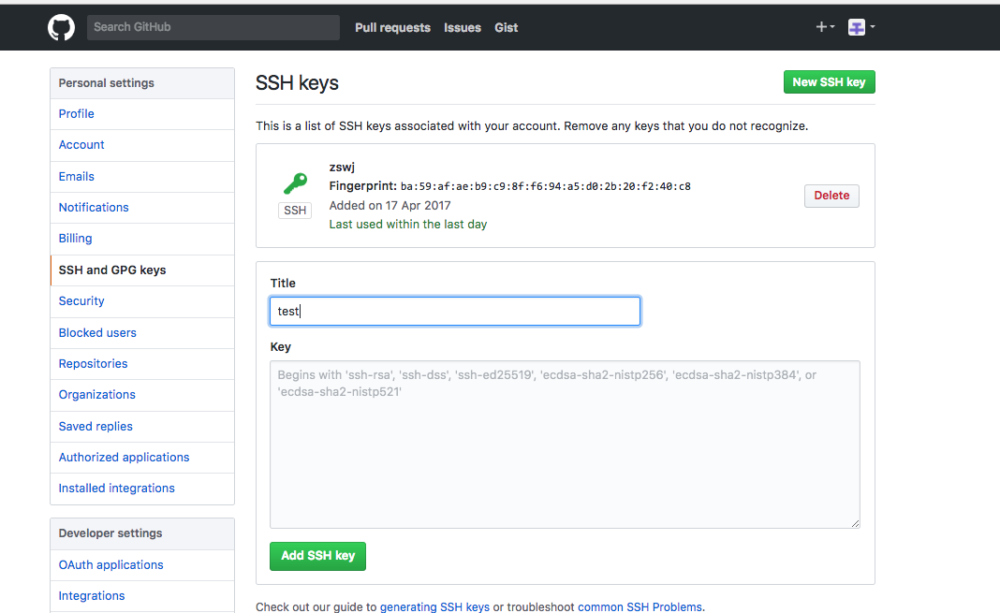
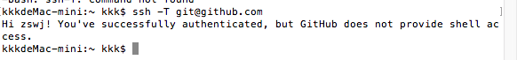
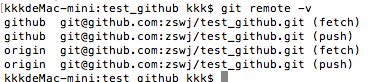
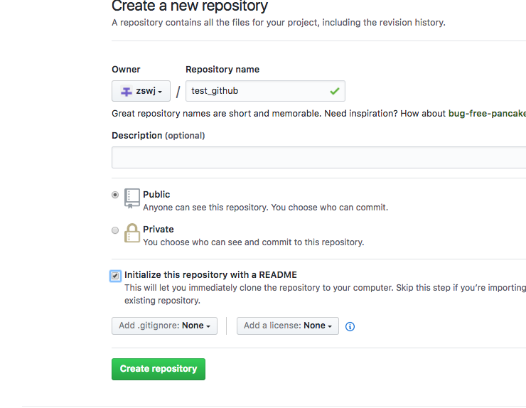
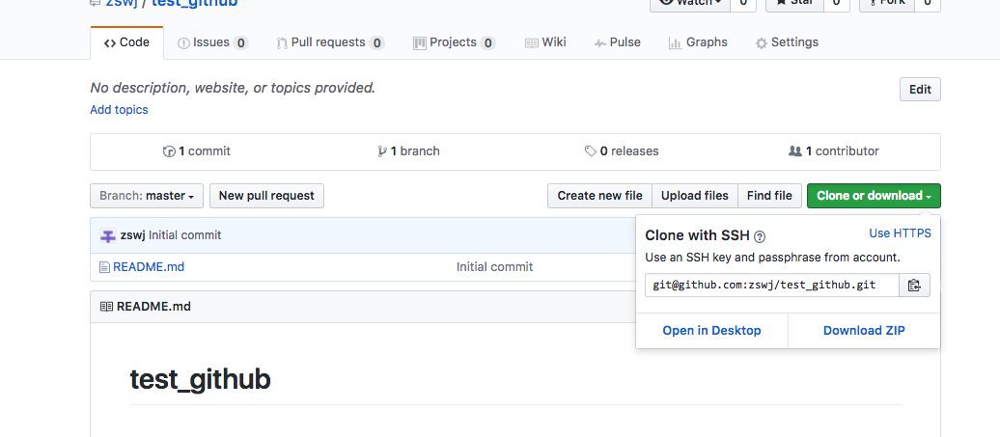
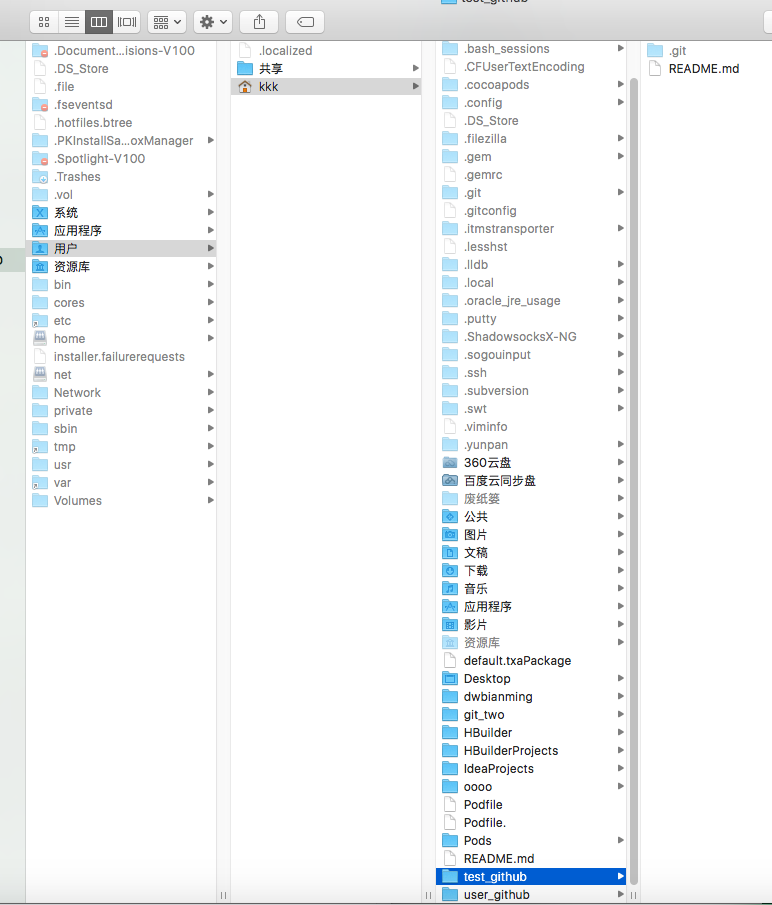
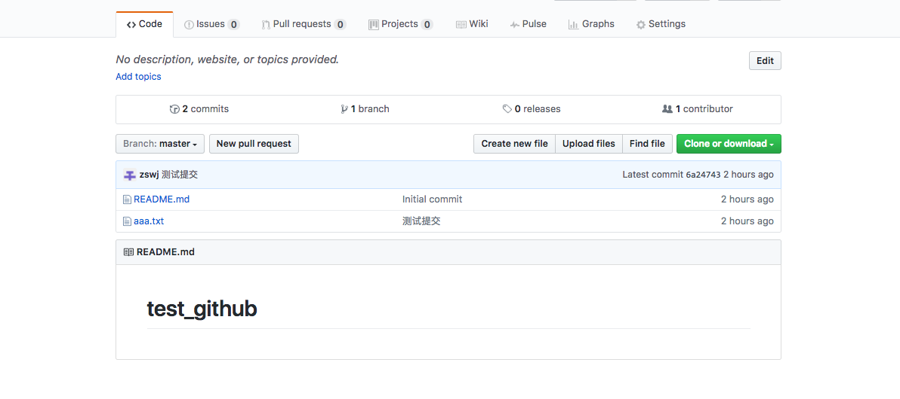

# ues_github
### github基础使用笔记

**前言**学习笔记
**github教程**申请github账号就不说了 就从上传开始
配置.SSH(SSH和https) 
终端输入命令 ssh-keygen -t rsa -C “你的邮箱(最好是github注册时的邮箱)”

这时你要设置生成.SSH的目录 如不设置 会自动默认路径 回车即可
生成之后 要把SSHkey添加到ssh-agent中
执行ssh-add ~/.ssh/id_rsa
然后cd/ssh 进入文件夹 执行more id_rsa.pub查看公钥 并复制然后登陆github 进入设置界面 添加进去
检测ssh公钥是否加入成功
ssh -T git@github.com 如出现如下 就是添加成功

git remote -v查看当前地址

这是ssh 地址
ssh切换到https
git remote set-url origin https://github.com/USERNAME/REPOSITORY_2.git
https切换到ssh
git remote set-url origin git@github.com/USERNAME/REPOSITORY_2.git

配置好之后开始上传
登陆github创建版本库(我是选中Initialize this repository with a README,不选要自己加哦)

创建好之后 克隆版本库到本地
git clone git@github.com:zswj/test_github.git
执行后 会在自己用户文件夹中出现

然后cd test_github
执行git add aaa.txt 回车
git commit -m "测试提交"
git remote add github git@github.com:zswj/test_github.git
git push -u github master

分支 里程碑 有时间在笔记
这样就加进去了
参考文章
(http://rogerdudler.github.io/git-guide/index.zh.html)
http://www.worldhello.net/gotgithub/index.html
https://github.com/xirong/my-git/blob/master/how-to-use-github.md
